# CHIRIMEN OS イメージの焼き方

## CHIRIMEN の OS イメージについて

- CHIRIMEN の OS イメージは、 Rasbian OS をカスタマイズしたもので、下記の２種類があります。
- URL 又は、QR コードから OS イメージをダウンロードして下さい。

### CHIRIMEN for Raspberry Pi

- Raspberry Pi 3B+, 4B 用(32bit)
- https://github.com/chirimen-oh/chirimen/releases/tag/20210812

  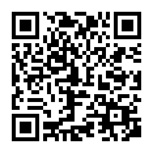

### CHIRIMEN for Raspberry Pi Zero

- Raspberry Pi Zero 用(32bit)
- https://github.com/chirimen-oh/chirimen-lite/releases/tag/v1.2.0

  

### Raspberry Pi 3B+, 4B 用(32bit) ダウンロード

1. https://github.com/chirimen-oh/chirimen へ行きます。 
   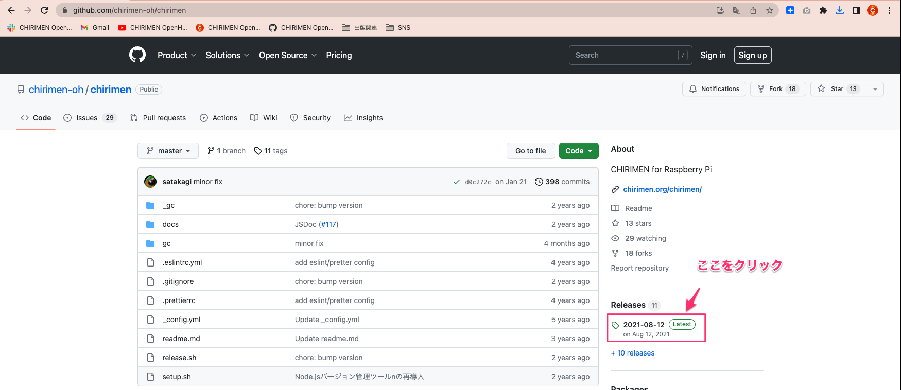

2. Releases をクリックします。 
   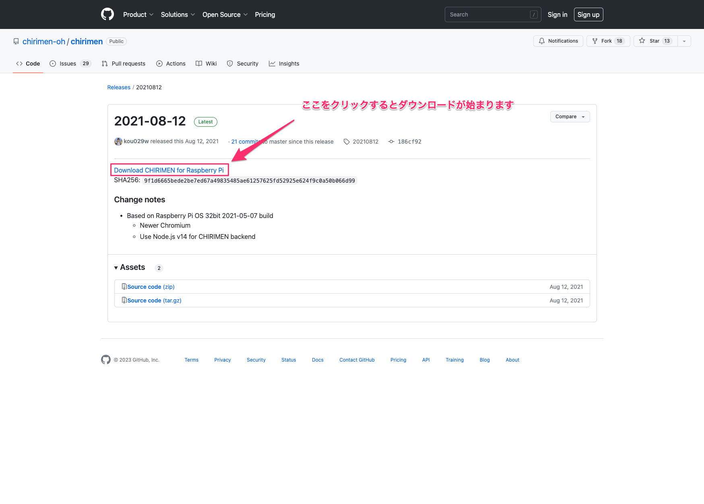

### Raspberry Pi Zero 用(32bit) ダウンロード

1. https://github.com/chirimen-oh/chirimen-lite へ行きます。 
   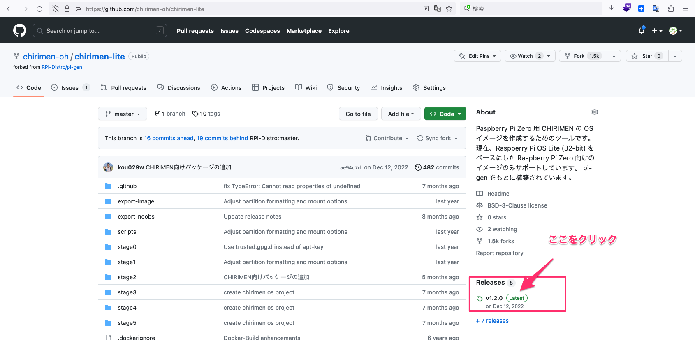

2. Releases をクリックします。 
   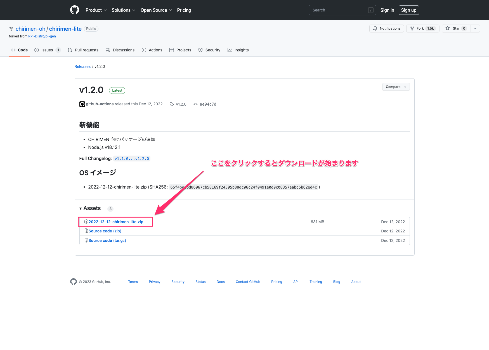

## CHIRIMEN の OS を SD カードに焼く

- Raspberry Pi Zero 用(32bit) を例に手順を解説します。
- mac OS と [balena Etcher](https://www.balena.io/etcher) を使った例です。
- ※ ご使用の OS やライティングソフトにあったものをお使い下さい

1. SD カードを初期化します。 
   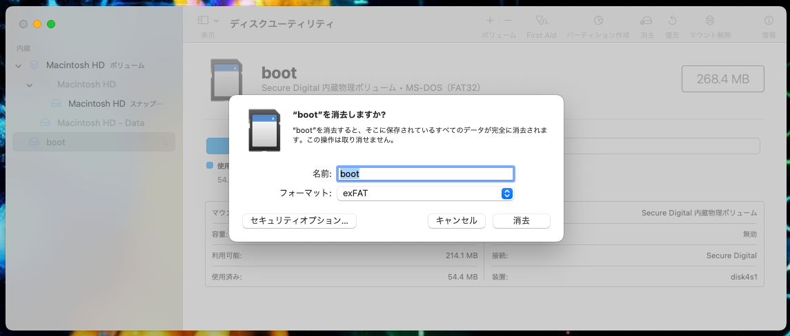
2. zip を解凍／展開します。 
   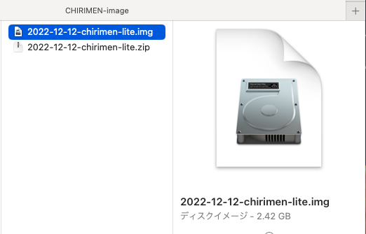
3. [balena Etcher](https://www.balena.io/etcher) を起動し、上記イメージを選択します。 
   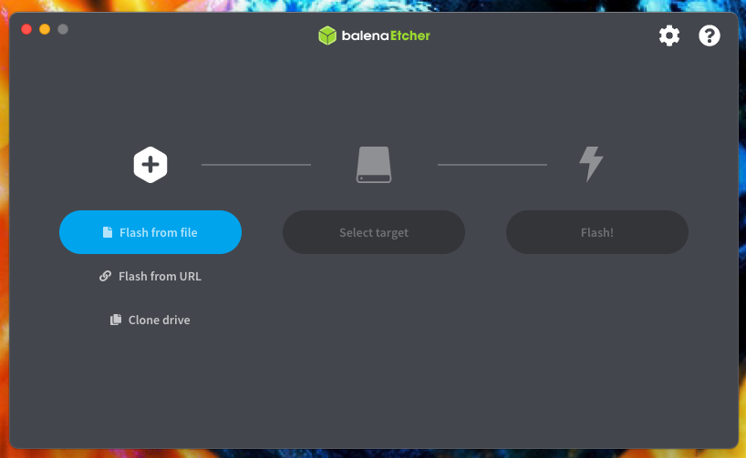
4. SD カードを選択します。 
   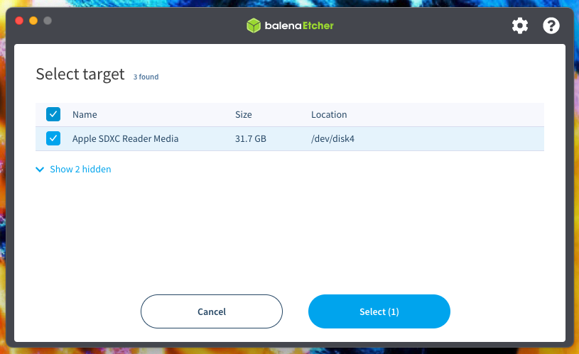
5. Flash ボタンをクリックし、書き込みを開始します。 
   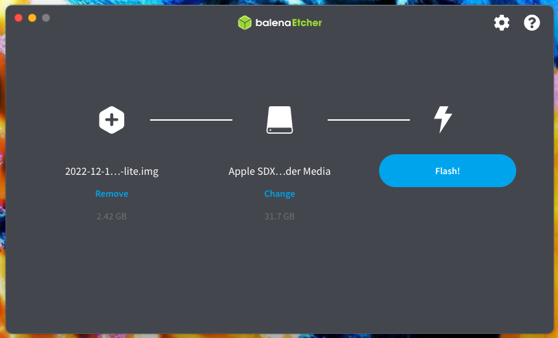
6. OS のパスワードを入力します。 
   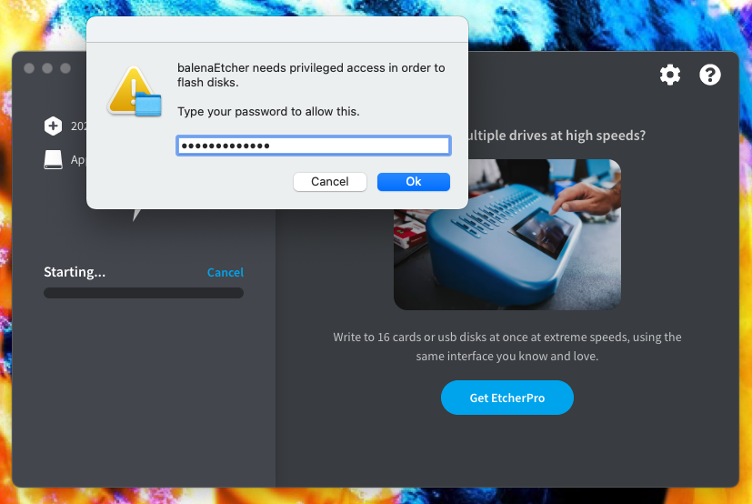
7. イメージを書き込み中です。 
   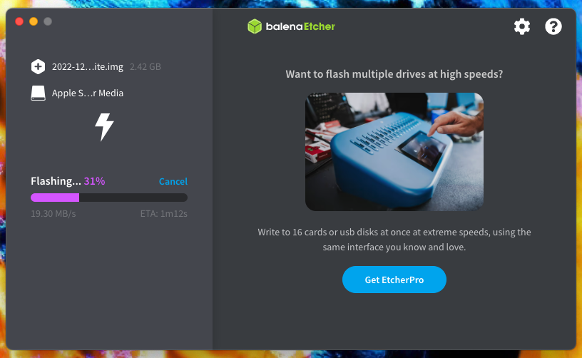
8. 書き込みが完了しました。 
   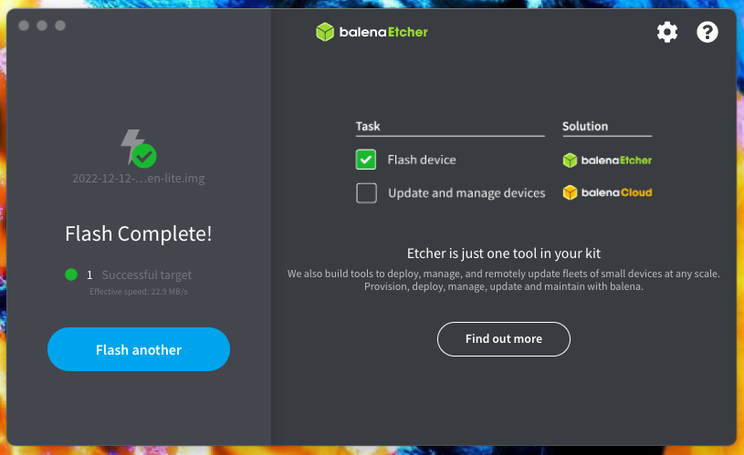

## CHIRIMEN の OS を 使う

- この手順で作成した SD カードをそれぞれの Raspberry Pi ボートに装着して起動して下さい。
- CHIRIMEN for Raspberry Pi
  - Raspberry Pi 3B+, 4B 用(32bit)
- CHIRIMEN for Raspberry Pi Zero
  - Raspberry Pi Zero 用(32bit)
